# Godot Showroom

Creating 3D scenes with Godot seems significantly easier compared to Unity. However, this assumes some knowledge of 3D modeling and a certain level of proficiency in Blender. 

Godot appears to be a useful learning material for physics and generative AI for high school and university students. The fact that it's free is a great advantage, allowing individuals to continue using it as a 3D UI creation tool even after entering the workforce.

<table>
 <tr>
  <td>
       
  </td>
  <td>
    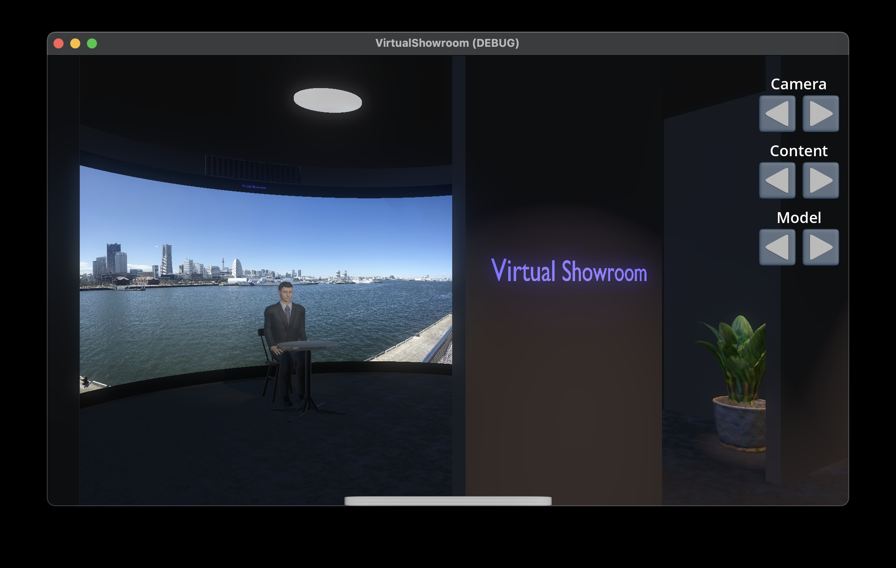   
  </td>
  <td>
    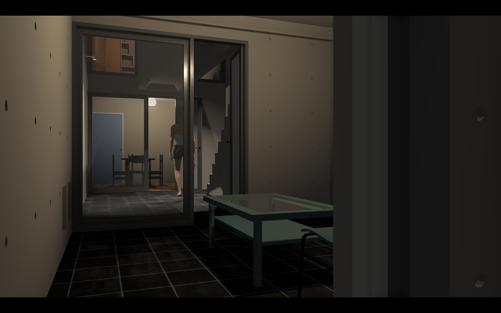      
  </td>
 </tr>
</table>

## Virtual Showroom

I remade the following project with Godot: https://github.com/araobp/virtual-showroom, but this time is a pure standalone app with neither RaspberryPi nor RAG/sqlite-vec.

To set your Gemini API key, enter your key in the following property editor:

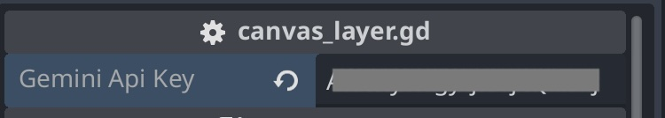

or create "gemini_api_key_env.txt" file with your Gemini API key value. The file is ignored by .gitignore.

### Virtual Showroom with Gemini

I've confirmed that the Gemini API can be used from GDScript.

<table>
 <tr>
  <td>
   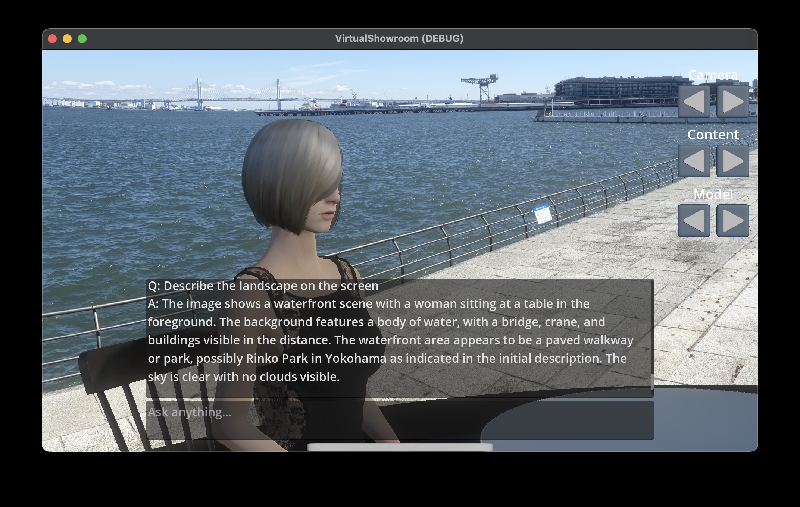
  </td>
  <td>
   
  </td>
 </tr>
</table>

=> [Code](/virtual_showroom)

### AI Robot with Gemini

I modified the robot from [Unity Starter Assets](https://assetstore.unity.com/packages/essentials/starter-assets-thirdperson-updates-in-new-charactercontroller-pa-196526) in Blender and added Mixamo animations.

<table>
 <tr>
  <td>
   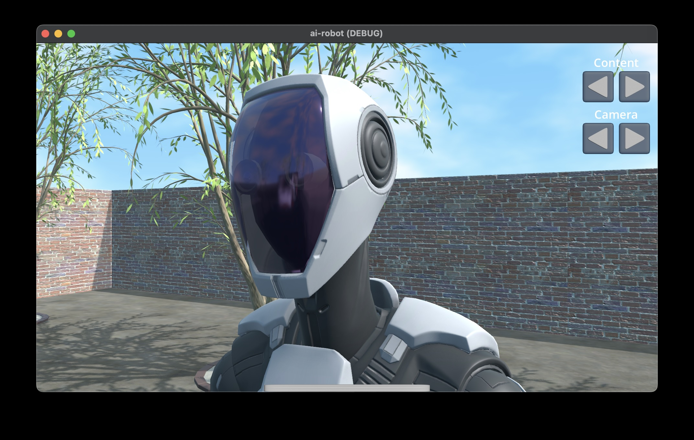   
  </td>
  <td>
   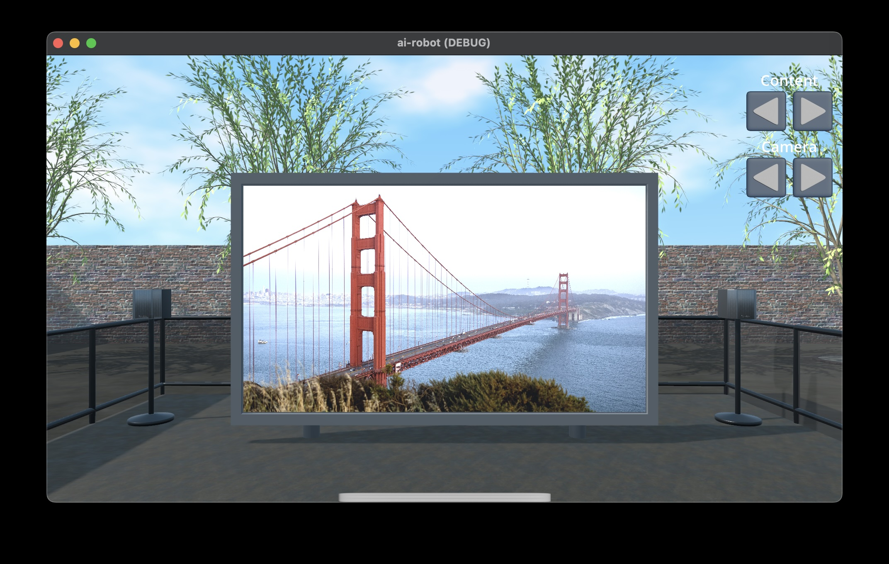   
  </td>
  <td>
   
  </td>
 </tr>
</table>

=> [Code](/ai_robot)

## Azuma House

[Azuma House](https://www.metalocus.es/en/news/row-house-sumiyoshi-azuma-house-tadao-ando)

Created based on [a publicly available IFC BIM model](https://openifcmodel.cs.auckland.ac.nz/). Characters were created with MPFB. The background is a NASA star map.

<table>
 <tr>
  <td>
       
  </td>
  <td>
    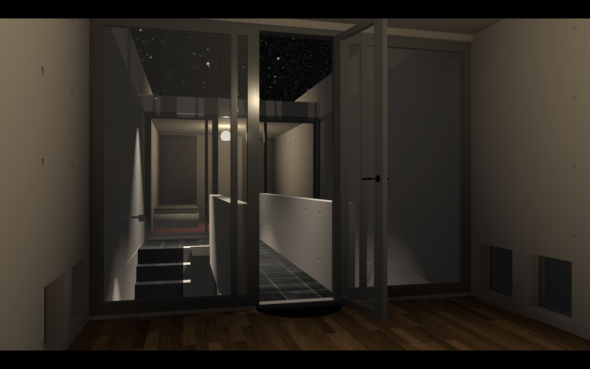    
  </td>
  <tr>
  <td>
        
  </td>
  <td>
    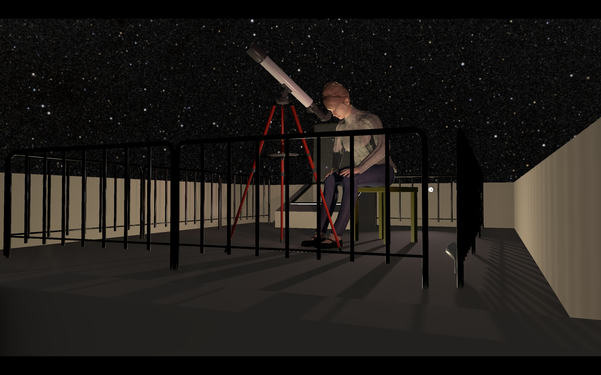    
  </td>   
  </tr>
 </tr>
</table>

=> [Code](/azuma_house)

Use W/A/S/D, I/J/K/L and UP/DOWN keys to move or rotate the camera in the scene.

## Pendlum Snake (Work in Progress)

=> [Code](pendlum_snake)

## Other projects

### Visual Shader Editor test

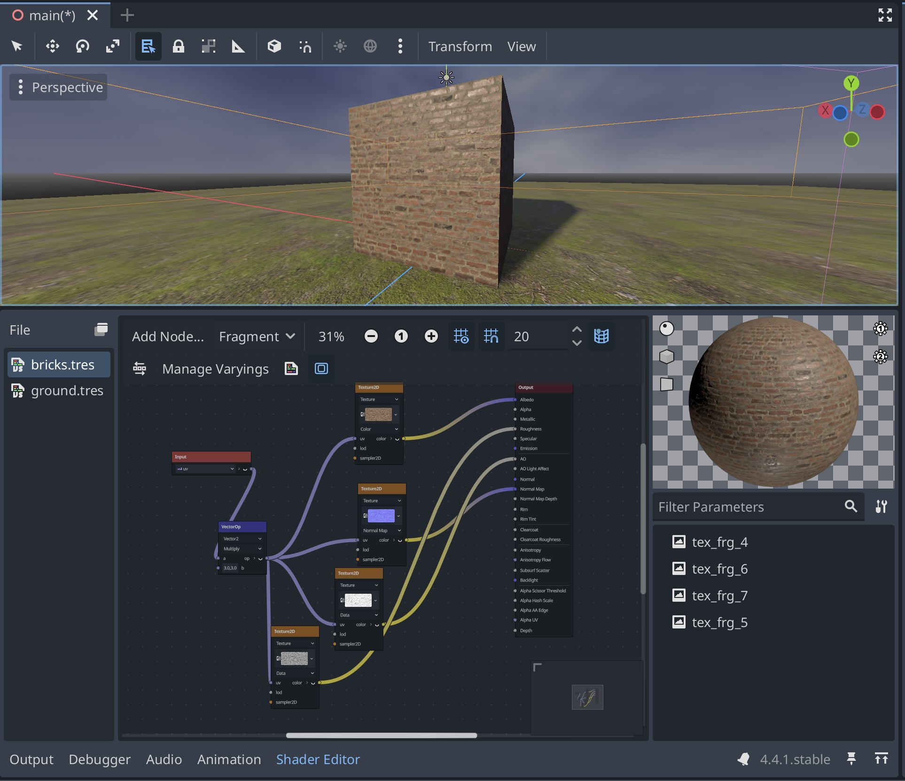

=> [Code](/visual_shader_editor_test)

### Physics test

=> [Code](/physics_test)

### Audio test

=> [Code](/audio_test)

### Audio Listener test

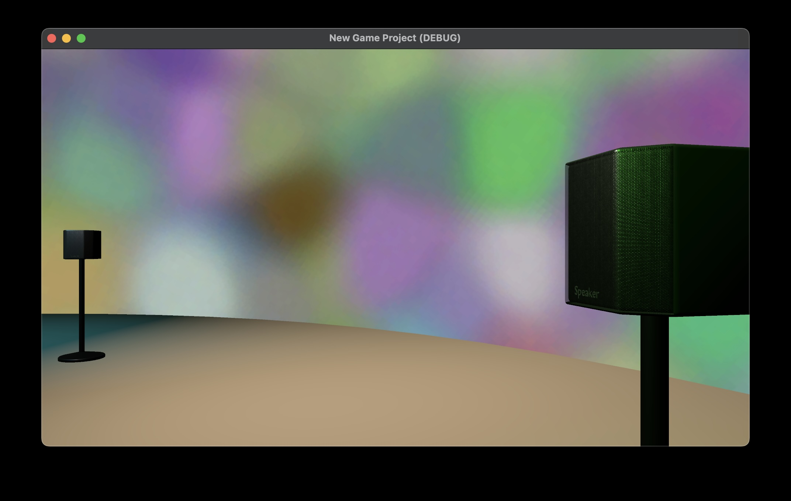

=> [Code](/audio_listener_test)

Use WASD keys to move/rotate the camera.

### Mixamo test ([Mixamo](https://www.mixamo.com/))

I've confirmed that Mixamo models can be imported into Godot. Controlling animations from GDScript is also easy.

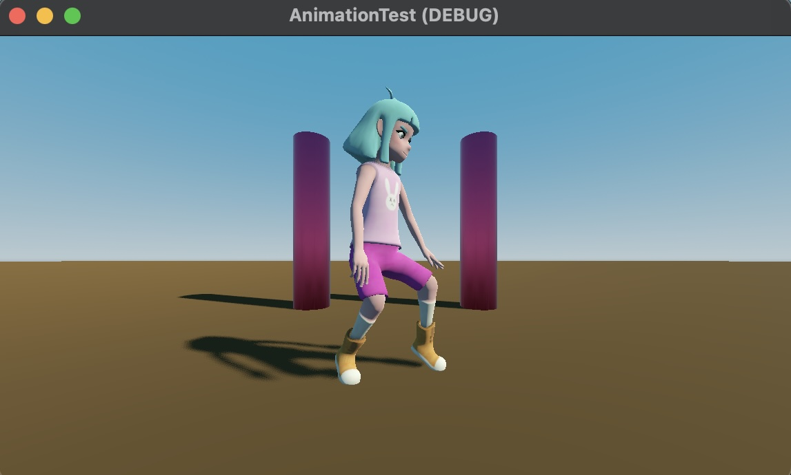

=> [Code](/animation_test)

### MPFB test ([MPFB](https://static.makehumancommunity.org/mpfb.html))

It has been confirmed that models created with MPFB can be imported into Godot. Animation control from GDScript is also easy.

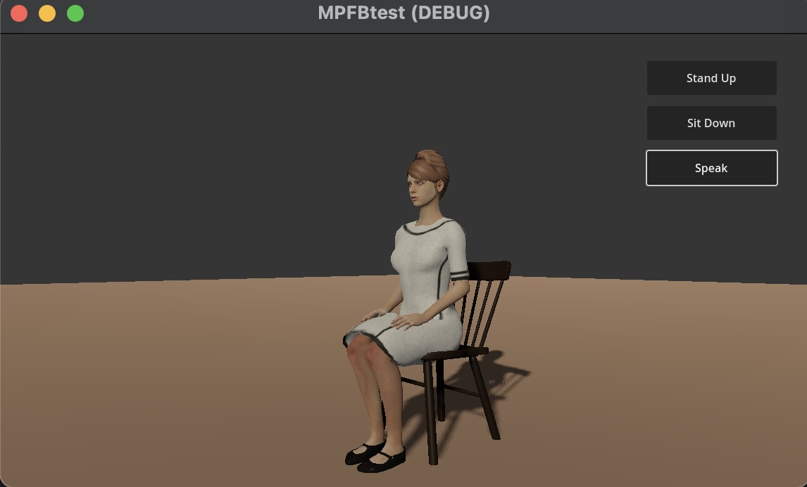

=> [Code](/mpfb_test)

## Notes on MPFB

The eye shader generated by MPFB does not work with Godot, so I made this eye material:

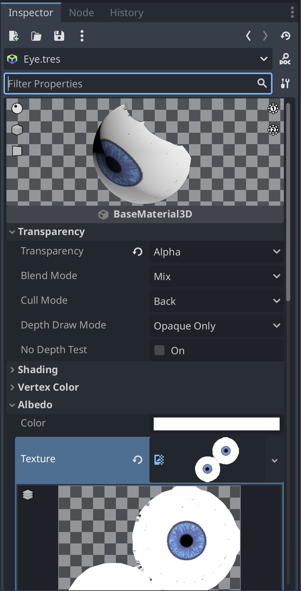

## Tips

=> [Tips](docs/TIPS.md)

## References

- [Godot documentation](https://docs.godotengine.org/en/stable/)
- [Mixamo](https://www.mixamo.com/)
- [HTTPRequest with await](https://zenn.dev/submax/articles/30433a77da3cca)
- [Multiple resolutions](https://docs.godotengine.org/en/stable/tutorials/rendering/multiple_resolutions.html)
- [How to Make Simple Realistic Skyboxes Using Noise in Godot - Godot 4 Tutorial](https://www.youtube.com/watch?v=gBKFJUETxIw)
- [How to Use the World Environment To Improve Visuals in Godot (Godot 4 Tutorial)](https://www.youtube.com/watch?v=nEiz9h4Ns0I)
