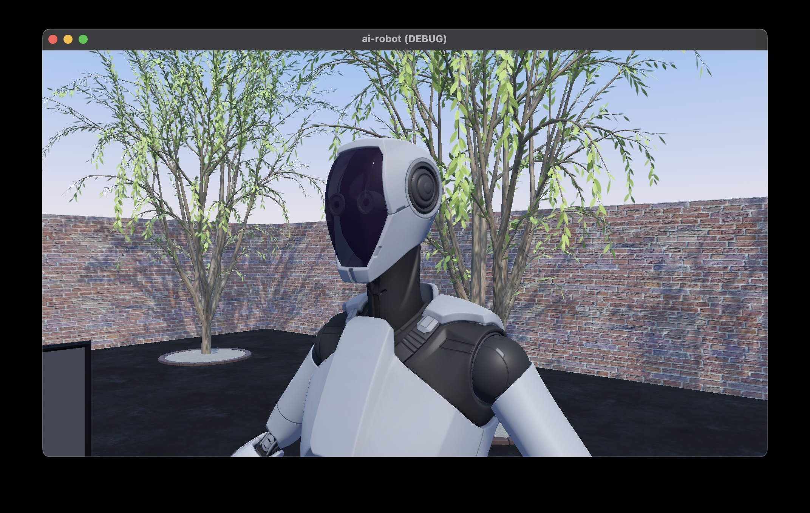

# Virtual Showroom with Godot

(Work in progress)

 
As an MVP developer, I've used Unity for many years, but there have been several challenges, such as the high licensing fees and the need for high-spec PCs.

In MVP development, high functionality isn't required; instead, low cost and quick turnaround are essential. I'm looking into Godot and would like to compare its low-cost and rapid development capabilities with Unity.

## Goal of this project

Remake the following project with Godot: https://github.com/araobp/virtual-showroom

## Code

## Mixamo test ([Mixamo](https://www.mixamo.com/)}

I've confirmed that Mixamo models can be imported into Godot. Controlling animations from GDScript is also easy.

=> [Code](/animationtest)

## MPFB test ([MPFB](https://static.makehumancommunity.org/mpfb.html))

It has been confirmed that models created with MPFB can be imported into Godot. Animation control from GDScript is also easy.

=> [Code](/mpfbtest)

## Virtual Showroom with GenAI (Work in Progress)

I've confirmed that the Gemini API can be used from GDScript.

Note: "gemini_api_key_env.txt" file (Gemini API key value) is ignored by .gitignore.

=> [Code](/virtual-showroom)

## References

- https://docs.godotengine.org/en/stable/
